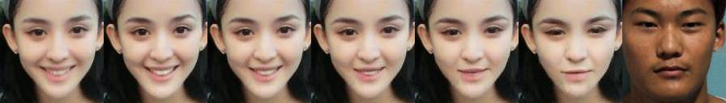

# Facial Expression GAN
## 依赖
- python
   - torch
   - torchvision
   - visdom
   - imageio
   - OpenCV
   - [face_recognition](https://github.com/ageitgey/face_recognition)提取剪裁人脸

- CMU [Open Face](https://cmusatyalab.github.io/openface/)获取表情AUs

## 训练
- 数据集准备, 数据集目录结构
   - `imgs/`人脸剪裁后`128*128`图像
   - `train_ids.csv` 单列CSV文件, 图像文件名
   - `aus_openface.pkl` python持久化字典, key是图像文件名(不带扩展名)
- 训练启动

```
python main.py --data_root <DataSet Root Dir name> --gpu_ids <GPU IDs> --sample_img_freq <Sample Frequency> --visdom_display_id 0
```

## 预处理好的数据集, 预训练模型下载
- 浙大云盘
   - `datasets/` 分享  `https://pan.zju.edu.cn/share/5e439e935aa947f25fea3a946a` 密码`2333`
   - `ckpts/` 分享 `https://pan.zju.edu.cn/share/409d4ca322d601ec3e44caac40` 密码`2333`
- 保留目录结构, 拷贝至工程根目录
   - `datasets/`
      - `celebA/`
      - `own/`
   - `ckpts/`
      - `emotionNet`
      - `celebA/`

## 使用自定义数据集测试
- 代码增加
   - 继承`BaseDataset` 详见`data/own.py`
   - 修改`data_loader`分支逻辑, 自定义数据集名字
- 数据集准备
   - `python crop_images.py <Original Image Dir> <Output Image Dir>` 得到`128*128`人脸图像目录`imgs/`
   - 将`generate_aus.py` 拷贝至 `FaceLandmarkImg.exe` 所在目录, `python generate_aus.py <Cropped Image Dir> aus_openface.pkl` 得到`aus_openface.pkl`和`test_ids.csv`

- 测试启动
   - `bash run_own`在自定义数据集`own`上测试, 使用模型`GANimation on emotionNet`
   - `bash run_default`在明星人脸数据集`celebA`上测试, 使用模型`GANimation on emotionNet`

- 部分结果
  - GIF
    <div align="center">
      
      
      
       
      
    </div>

  - 线性差值表情序列
    - 
    
    - 

    - 

    - 

    - 

    - 

    - 

    - 

    - 